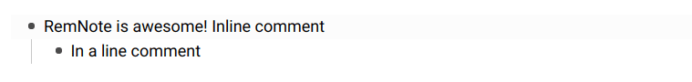

# CSS Snippets

Install these by pasting the css snippets into an empty template block in your `⮉ Custom CSS` page.

<!-- TODO: Everything is also available from this shared page: https://www.remnote.io/a/custom-css/AonR8HbC9uQG2psFJ -->

## Fullscreen Queue

```css
@import url("https://cdn.jsdelivr.net/gh/hannesfrank/awesome-remnote/css/fullscreen-queue.css");
```

## Scroll Further Down

Ability to scroll further down such that you don't have to write on the bottom of the page.

```css
@import url("https://cdn.jsdelivr.net/gh/hannesfrank/awesome-remnote/css/scroll-further-down.css");
```


## Highlight Focused Rem

```css
@import url("https://cdn.jsdelivr.net/gh/hannesfrank/awesome-remnote/css/highlight-focused-rem.css");

/* Configuration: Choose a highlight color */
:root {
  --focused-rem-highlight-color: #fafada; /* Light yellow. */
  /*--focused-rem-highlight-color: lightgrey; */
}
```

## ☣️ Divider

<blockquote>

**THIS IS A HACK. USE ONLY IF YOU KNOW WHAT YOU ARE DOING.**

_It repurposes a feature of RemNote.
This means that every place where you used it already will look differently.
And that your shared pages will look differently for other users and vice versa.
When this feature gets implemented natively you have to go through all instances and convert them manually._

</blockquote>


Replace the purple highlight (<kbd>Ctrl</kbd> + <kbd>Alt</kbd> + <kbd>9</kbd>) with a divider.

If you don't want purple gone but another color, copy the css instead and change `purple` to another highlight color (red, orange, yellow, green, blue, purple).

```css
@import url("https://cdn.jsdelivr.net/gh/hannesfrank/awesome-remnote/css/hacky-divider.css");
```

## ☣️ Comment

<blockquote>

**THIS IS A HACK. USE ONLY IF YOU KNOW WHAT YOU ARE DOING.**

_It repurposes a feature of RemNote.
This means that every place where you used it already will look differently.
And that your shared pages will look differently for other users and vice versa.
When this feature gets implemented natively you have to go through all instances and convert them manually._

</blockquote>



Replace the orange highlight (<kbd>Ctrl</kbd> + <kbd>Alt</kbd> + <kbd>5</kbd>) with smaller grey text.

If you don't want orange gone but another color, copy the css instead and change `orange` to another highlight color (red, orange, yellow, green, blue, purple).

```css
@import url("https://cdn.jsdelivr.net/gh/hannesfrank/awesome-remnote/css/hacky-comment.css");

/* Configuration */
:root {
  --comment-font-size: 11px;
  --comment-color: grey;
  --comment-background: transparent;
}
```
