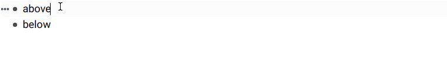

# CSS Snippets

Install these by pasting the relevant bits into your `⮉ Custom CSS` page.

<!-- TODO: Everything is also available from this shared page: https://www.remnote.io/a/custom-css/AonR8HbC9uQG2psFJ -->

## Fullscreen Queue

```css
@import url("https://cdn.jsdelivr.net/gh/hannesfrank/awesome-remnote@master/css/fullscreen-queue.css");
```

## Highlight Focused Rem

```css
@import url("https://cdn.jsdelivr.net/gh/hannesfrank/awesome-remnote@master/css/highlight-focused-rem.css");

/* Configuration: Choose a highlight color */
:root {
  --focused-rem-highlight-color: #fafada; /* Light yellow. */
  /*--focused-rem-highlight-color: lightgrey; */
}
```

## Hacky divider



_☣️ THIS IS A HACK. USE ONLY IF YOU KNOW WHAT YOU ARE DOING. (It is save though.)_

Replace the purple highlight (<kbd>Ctrl</kbd> + <kbd>Alt</kbd> + <kbd>9</kbd>) with a divider.
If you don't want purple gone but anothter color, copy the css instead and `purple` to another highlight color.

```css
@import url("https://cdn.jsdelivr.net/gh/hannesfrank/awesome-remnote@master/css/hacky-divider.css");
```
